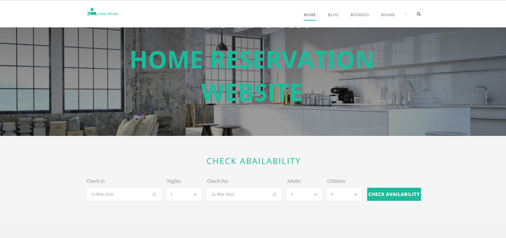

# Hotel Whale
Hotel  is  a  web  application  for  hotel  reservation  works  by  processing  online  reservations  made  through  a  hotel's  website.  The  data  is  then  passed  to  a  back-end  system  which  can  be  accessed  by  hotels  to  manage  bookings.  The  automation  of  reservation  confirmation  emails.

## Table of contents
* [General info](#general-info)
* [Demo](#demo)
* [Screenshots](#screenshots)
* [Technologies](#technologies)
* [Setup](#setup)
* [Features](#features)
* [Status](#status)
* [Contact](#contact)
* [License](#license)

## General info
A hotel reservation system is a necessity for today’s accommodation providers, both large and small.
An increasing number of travelers are relying solely on online reservations in order to book their accommodations, and without this capability, you will lose a significant amount of business.

## Demo

## Screenshots

## Technologies
* Wordpress - version 5.6

## Setup

## Features
* Book a room
* Search
* Blog

## Status
Project is: _finished_

## Contact
contact@delta-dev-software.com

## License
